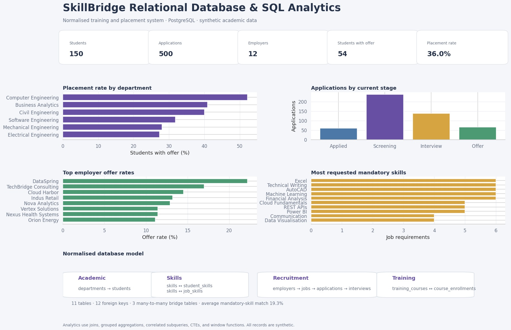
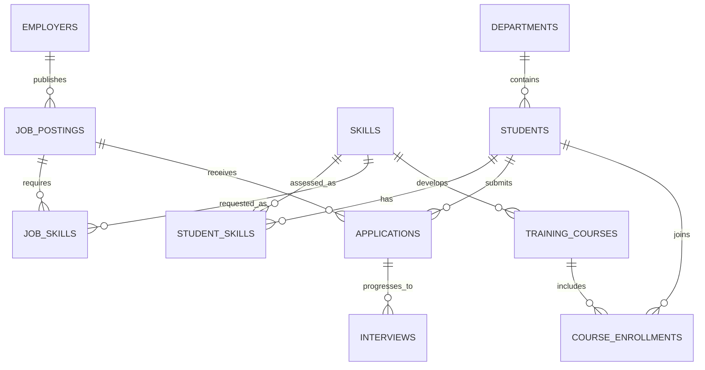

# Relational Database Design & SQL Analytics

[](https://www.postgresql.org/)
[](#sql-question-set)
[](docs/NORMALIZATION.md)
[](#validation)

An academic database project for **SkillBridge**, a simulated university training and placement system. The repository covers requirements-to-schema design, third-normal-form modelling, constrained DDL, deterministic population, analytical views, and a ten-question SQL exercise using joins, grouped aggregations, correlated subqueries, CTEs, and window functions.

> All students, employers, applications, interviews, courses, scores, and outcomes are synthetic. The project does not represent a real university or hiring programme.



## Project scope

- **11 related tables** covering academics, skills, recruitment, interviews, and training.
- **12 foreign keys** that enforce entity relationships.
- **3 many-to-many bridge tables** with composite primary keys.
- Unique constraints for business keys such as registration number, email, job application, and interview round.
- Check constraints for CGPA, dates, openings, proficiency, quantity-like levels, scores, stages, and outcomes.
- **150 students, 28 jobs, 500 applications, and 268 interviews** generated reproducibly.
- Three reporting views for the application funnel, candidate/job skill match, and department placement.
- Ten solved SQL questions plus a separate integrity-check script.

## Simulated analytical summary

| Metric | Result |
|---|---:|
| Students | 150 |
| Employers | 12 |
| Job postings | 28 |
| Applications | 500 |
| Students with at least one offer | 54 |
| Student placement rate | 36.0% |

Computer Engineering has the highest simulated placement rate at **52.2%**. Two job postings are intentionally left without applications so the outer-join exception query has a meaningful result. These are generated observations, not claims about real graduates or employers.

## Entity relationship model



The modelling decisions and 1NF/2NF/3NF reasoning are explained in [NORMALIZATION.md](docs/NORMALIZATION.md).

## Quick start

### Validate locally with SQLite

SQLite is used only as an independent automated test engine for the standard SQL subset.

```bash
git clone https://github.com/zararshahid25/relational-database-sql-analytics.git
cd relational-database-sql-analytics
python -m venv .venv
pip install -r requirements.txt
python -m src.generate_seed_data
python -m src.build_preview
pytest -q
```

### Load PostgreSQL

```bash
cp .env.example .env
# Replace the example password and load DATABASE_URL into your environment
docker compose up -d
python -m src.load_postgres
```

You can then run `sql/04_question_set.sql` in pgAdmin or `psql`.

## SQL execution order

| Order | File | Purpose |
|---:|---|---|
| 1 | `sql/01_schema.sql` | Drop/recreate tables, keys, relationships, checks, indexes |
| 2 | `sql/02_seed_data.sql` | Populate all tables in dependency order within a transaction |
| 3 | `sql/03_views.sql` | Create reusable analytics views |
| 4 | `sql/04_question_set.sql` | Answer ten business and academic questions |
| 5 | `sql/05_integrity_checks.sql` | Return duplicates, orphans, invalid scores, or invalid completion records |

## SQL question set

1. Count applications by current stage.
2. Rank employers by offer rate with a minimum application threshold.
3. Find students above their own department's average CGPA using a correlated subquery.
4. Find job postings with no applications using an outer join.
5. Calculate department placement rates with distinct conditional counts.
6. Identify the largest mandatory-skill supply gaps with CTEs.
7. Rank candidates within every job using skill match, interview score, and `DENSE_RANK`.
8. Compare interview reach for students with and without completed training.
9. Report monthly applications and offers.
10. Find candidates who meet every mandatory skill for an applied job.

The concept-to-question mapping is in [QUERY_GUIDE.md](docs/QUERY_GUIDE.md).

### Example: candidate ranking

```sql
WITH interview_scores AS (
    SELECT application_id, AVG(score) AS average_interview_score
    FROM interviews
    GROUP BY application_id
), candidate_scores AS (
    SELECT
        a.job_id,
        a.application_id,
        s.full_name,
        m.mandatory_skill_match_pct,
        COALESCE(i.average_interview_score, 0) AS average_interview_score,
        0.6 * m.mandatory_skill_match_pct
          + 0.4 * COALESCE(i.average_interview_score, 0) AS composite_score
    FROM applications a
    JOIN students s ON s.student_id = a.student_id
    JOIN vw_candidate_job_match m ON m.application_id = a.application_id
    LEFT JOIN interview_scores i ON i.application_id = a.application_id
)
SELECT
    job_id,
    full_name,
    ROUND(composite_score, 1) AS composite_score,
    DENSE_RANK() OVER (
        PARTITION BY job_id
        ORDER BY composite_score DESC
    ) AS candidate_rank
FROM candidate_scores;
```

## Project structure

```text
relational-database-sql-analytics/
├── sql/
│   ├── 01_schema.sql             # DDL, keys, constraints, indexes
│   ├── 02_seed_data.sql          # Generated deterministic DML
│   ├── 03_views.sql              # Reusable analytics views
│   ├── 04_question_set.sql       # Ten solved SQL questions
│   └── 05_integrity_checks.sql   # Exception checks
├── data/seed/                    # Inspectable CSV version of every table
├── src/
│   ├── generate_seed_data.py     # Rebuilds seed CSVs and INSERT statements
│   ├── load_postgres.py          # PostgreSQL loader
│   └── build_preview.py          # Executes database and exports summary
├── docs/                         # Normalisation, dictionary, query guide
├── reports/                      # Query-result extracts
├── assets/                       # Shareable portfolio image
└── tests/test_database.py        # Syntax, constraints, views, query tests
```

## Validation

```bash
python -m pytest -q
```

The five tests verify:

1. PostgreSQL-dialect parsing of every SQL file;
2. seed counts and absence of orphan applications;
3. rejection of a duplicate bridge key and a CGPA above 4.0;
4. valid 0–100 analytical rates from all reporting views;
5. execution of all ten questions and exactly two reserved jobs with no applicants.

## Author

**Zarar Shahid**  
[LinkedIn](https://www.linkedin.com/in/zarar-shahid-0768aa349/) · [GitHub](https://github.com/zararshahid25)

